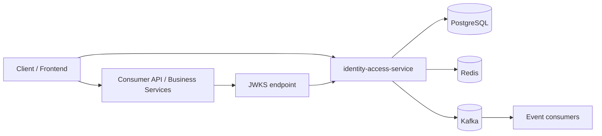

# Guía de integración de `identity-access-service`

## Propósito

Esta guía explica cómo instalar y usar `identity-access-service` en cualquier sistema que necesite cubrir autenticación, autorización, sesiones, JWT/JWKS, roles, permisos y eventos de seguridad.

El servicio debe tratarse como un servicio IAM interno desplegable, no como una librería embebida ni como un SaaS hospedado. Los sistemas consumidores se integran por HTTP, JWT/JWKS, claims, permisos y, opcionalmente, eventos Kafka.

## Modelo de integración

`identity-access-service` cubre estas áreas:

- Autenticación: registro, login, refresh y logout.
- Autorización: roles, permisos y perfil efectivo de acceso.
- Sesiones: apertura, rotación y revocación.
- Tokens: JWT RS256 verificables por otros servicios mediante JWKS.
- Catálogo RBAC: roles y permisos administrables.
- Auditoría/outbox: eventos de seguridad e integración.

El sistema consumidor no debe guardar passwords ni validar credenciales directamente. Esa responsabilidad queda en `identity-access-service`.

## Arquitectura recomendada



Flujo principal:

1. El cliente hace login contra `identity-access-service`.
2. El servicio devuelve `accessToken` y `refreshToken`.
3. El cliente llama APIs del sistema consumidor con `Authorization: Bearer <accessToken>`.
4. Cada API consumidora valida la firma del JWT usando `/.well-known/jwks.json`.
5. Cada API consumidora autoriza acciones usando permisos del claim `permissions`.
6. Los cambios relevantes pueden consumirse desde Kafka si el sistema usa integración asíncrona.

## 1. Despliegue

La forma recomendada es desplegar `identity-access-service` como microservicio independiente junto a sus dependencias:

- PostgreSQL: persistencia IAM.
- Redis: rate limiting y cache operativo.
- Kafka: outbox/eventos, si necesitas integración asíncrona.
- Llaves RSA: firma y verificación de JWT.

Modo rápido con Docker Compose:

```bash
cp .env.example .env
docker compose up -d --build
```

Modo local con dependencias en Docker y aplicación en host:

```bash
cp .env.example .env
set -a
source .env
set +a
docker compose up -d postgres redis kafka
SPRING_PROFILES_ACTIVE=local ./gradlew bootRun --no-daemon
```

## 2. Configuración mínima

Configura al menos estas variables para una instalación real:

```env
SPRING_PROFILES_ACTIVE=docker

APP_SECURITY_JWT_ISSUER=identity-access-service
APP_SECURITY_JWT_AUDIENCE=your-system-client
APP_SECURITY_JWT_KEY_ID=your-key-id
APP_SECURITY_JWT_PRIVATE_KEY_PATH=/secrets/jwt-private.pem
APP_SECURITY_JWT_PUBLIC_KEY_PATH=/secrets/jwt-public.pem

APP_DOCKER_R2DBC_URL=r2dbc:postgresql://postgres:5432/identity_access
APP_DOCKER_R2DBC_USERNAME=identity_access
APP_DOCKER_R2DBC_PASSWORD=change-me

APP_DOCKER_REDIS_HOST=redis
APP_DOCKER_REDIS_PORT=6379
APP_DOCKER_REDIS_PASSWORD=change-me

APP_DOCKER_KAFKA_BOOTSTRAP_SERVERS=kafka:9092
```

En producción no uses las llaves `dev-*` incluidas en el proyecto. Debes montar o inyectar llaves RSA reales desde un gestor de secretos o volumen seguro.

## 3. Primera cuenta administrativa

Con la configuración por defecto, `register-primary` crea la cuenta inicial/bootstrap con rol `SYSTEM_ADMIN`.
`SYSTEM_ADMIN` es exclusivo: solo puede existir una asignación activa. Usa este rol como cuenta raíz de recuperación/operación excepcional y delega operación diaria en roles como `ACCESS_ADMIN`.

```bash
curl -X POST http://localhost:8080/api/v1/auth/register-primary \
  -H 'Content-Type: application/json' \
  -d '{
    "email": "admin@your-system.com",
    "password": "Admin123!"
  }'
```

Para cuentas públicas normales sin permisos administrativos, usa `register`; el rol inicial por defecto es `ACCOUNT_USER`:

```bash
curl -X POST http://localhost:8080/api/v1/auth/register \
  -H 'Content-Type: application/json' \
  -d '{
    "email": "user@your-system.com",
    "password": "User123!"
  }'
```

Login:

```bash
curl -X POST http://localhost:8080/api/v1/auth/login \
  -H 'Content-Type: application/json' \
  -H 'User-Agent: your-system' \
  -d '{
    "email": "admin@your-system.com",
    "password": "Admin123!"
  }'
```

Respuesta esperada:

```json
{
  "accessToken": "...",
  "refreshToken": "...",
  "sessionId": "...",
  "tokenType": "Bearer"
}
```

## 4. Protección de APIs consumidoras

Tus servicios consumidores deben validar el `accessToken`.

Contrato mínimo:

- Validar firma JWT usando JWKS.
- Validar `iss` contra `APP_SECURITY_JWT_ISSUER`.
- Validar `aud` contra el audience configurado para tu sistema.
- Validar expiración `exp`.
- Autorizar por permisos del claim `permissions`.

JWKS endpoint:

```http
GET http://identity-access-service:8080/.well-known/jwks.json
```

Header esperado en llamadas al sistema consumidor:

```http
Authorization: Bearer <accessToken>
```

Claims relevantes:

- `sub`: id de cuenta/usuario.
- `sid`: id de sesión.
- `email`: email autenticable.
- `roles`: roles efectivos.
- `permissions`: permisos efectivos.
- `iss`: issuer.
- `aud`: audience.
- `exp`: expiración.
- `jti`: id del token.

## 5. Autorización por permisos

Los sistemas consumidores deben proteger acciones usando permisos, no roles directamente.

Ejemplo conceptual:

```text
Permiso requerido por endpoint: billing.invoice.read
Permisos en token: [billing.invoice.read, billing.invoice.create]
Resultado: allow
```

Puedes crear permisos propios del sistema consumidor desde el catálogo IAM:

```http
POST /api/v1/admin/iam/permissions
Authorization: Bearer <SYSTEM_ADMIN_ACCESS_TOKEN>
Content-Type: application/json
```

Body:

```json
{
  "permissionCode": "billing.invoice.read",
  "resource": "billing.invoice",
  "action": "read",
  "scope": "GLOBAL",
  "description": "Read invoices",
  "systemPermission": false
}
```

Luego puedes asignar ese permiso a un rol:

```http
POST /api/v1/admin/iam/roles/{roleId}/permissions
Authorization: Bearer <SYSTEM_ADMIN_ACCESS_TOKEN>
Content-Type: application/json
```

Body:

```json
{
  "permissionCode": "billing.invoice.read"
}
```

Para consultar los permisos vigentes de un rol específico:

```http
GET /api/v1/admin/iam/roles/{roleId}/permissions
Authorization: Bearer <SYSTEM_ADMIN_ACCESS_TOKEN>
```

## 6. Creación de cuentas posteriores

Para crear cuentas adicionales, usa el endpoint administrativo:

```http
POST /api/v1/admin/iam/accounts
Authorization: Bearer <SYSTEM_ADMIN_ACCESS_TOKEN>
Content-Type: application/json
```

Body con rol explícito:

```json
{
  "email": "user@your-system.com",
  "password": "User123!",
  "roleCode": "ACCOUNT_USER"
}
```

Body sin rol explícito:

```json
{
  "email": "user@your-system.com",
  "password": "User123!"
}
```

Si no se envía `roleCode`, el servicio usa `APP_IAM_REGISTRATION_ADMIN_DEFAULT_ROLE_CODE`, que por defecto es `ACCOUNT_USER`.

Consultas administrativas útiles:

```http
GET /api/v1/admin/iam/accounts
Authorization: Bearer <SYSTEM_ADMIN_ACCESS_TOKEN>
```

```http
GET /api/v1/admin/iam/sessions
Authorization: Bearer <SYSTEM_ADMIN_ACCESS_TOKEN>
```

Para validación de release en ambientes limpios puedes ejecutar:

```bash
BASE_URL=http://localhost:8080 scripts/smoke/identity-access-release-smoke.sh
```

El procedimiento break-glass de `SYSTEM_ADMIN` está documentado en `docs/operations/break-glass-system-admin.md` y requiere acceso directo a PostgreSQL.

## 7. Refresh y logout

Cuando expire el access token, usa refresh:

```http
POST /api/v1/auth/refresh
Content-Type: application/json
```

Body:

```json
{
  "refreshToken": "<refreshToken>"
}
```

Para cerrar sesión:

```http
POST /api/v1/auth/logout
Authorization: Bearer <accessToken>
```

`logout` revoca la sesión asociada al token autenticado.

## 8. Introspección de token

Si un sistema necesita validar estado lógico del token, no solo firma criptográfica, puede usar introspection:

```http
POST /api/v1/auth/introspect
Content-Type: application/json
```

Body:

```json
{
  "token": "<accessToken>"
}
```

Esto es útil porque un token puede ser criptográficamente válido, pero no estar activo para IAM si la sesión fue revocada o la cuenta fue bloqueada.

## 9. Eventos de integración

Si tu sistema consume eventos, Kafka recibe hechos como:

- `iam.account-registered.v1`
- `iam.auth-failed.v1`
- `iam.session-opened.v1`
- `iam.session-refreshed.v1`
- `iam.session-revoked.v1`
- `iam.account-blocked.v1`
- `iam.role-assigned-to-account.v1`
- `iam.permission-granted-to-role.v1`
- `iam.permission-revoked-from-role.v1`

Usos típicos:

- Crear perfil en otro servicio cuando se registre una cuenta.
- Invalidar caches cuando cambia el acceso.
- Alimentar auditoría/reportería.
- Notificar eventos de seguridad.
- Reaccionar a revocaciones o bloqueos.

Si no necesitas eventos en una instalación, puedes desactivar el relay:

```env
APP_OUTBOX_RELAY_ENABLED=false
```

## 10. Modos de uso recomendados

### Servicio IAM central

Una instancia de `identity-access-service` opera como autoridad IAM para todo el sistema.

### Dependencia desplegable por instalación

Cada instalación del sistema despliega su propia instancia IAM con su propia base de datos, Redis, Kafka y llaves RSA.

### Módulo interno reutilizable

El servicio se empaqueta con Docker Compose, Helm, Terraform u otro mecanismo de despliegue y cada sistema lo incorpora como dependencia operacional.

La opción más alineada con un servicio reutilizable pero no SaaS es desplegarlo como dependencia por instalación o módulo interno reutilizable.

## 11. Contrato básico para sistemas consumidores

Todo sistema consumidor debe conocer:

- URL base de `identity-access-service`.
- JWKS URL.
- `issuer` esperado.
- `audience` esperado.
- Permisos requeridos por cada endpoint propio.
- Formato de claims.
- Estrategia de refresh/logout.
- Si consumirá eventos Kafka o solo HTTP/JWT.

## 12. Checklist de instalación

1. Configurar PostgreSQL.
2. Configurar Redis.
3. Configurar Kafka o desactivar outbox relay si no se usa.
4. Montar llaves RSA reales.
5. Definir `issuer` y `audience`.
6. Levantar `identity-access-service`.
7. Crear primera cuenta administrativa.
8. Crear roles/permisos propios del sistema consumidor.
9. Configurar servicios consumidores para validar JWT por JWKS.
10. Proteger endpoints consumidores por permisos.
11. Definir política de refresh/logout en clientes.
12. Decidir si se consumirán eventos Kafka.
13. Configurar observabilidad y alertas sobre health, outbox y errores de autenticación.

## 13. Reglas de integración importantes

- No revalides passwords fuera de `identity-access-service`.
- No copies tablas IAM a otros servicios para autorizar.
- No autorices por email.
- No dependas solo de roles si puedes autorizar por permisos.
- No uses llaves RSA de desarrollo fuera de local.
- No ignores `iss`, `aud` y `exp` al validar JWT.
- No asumas que un JWT válido criptográficamente sigue activo para IAM; usa introspection si necesitas estado lógico fuerte.
- No mezcles datos de perfil del sistema consumidor con la identidad autenticable del IAM.
